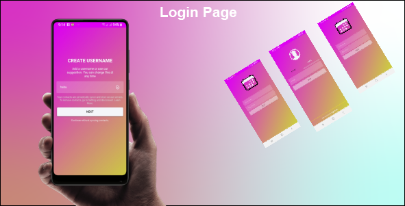
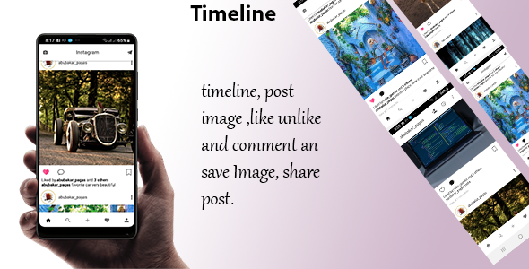
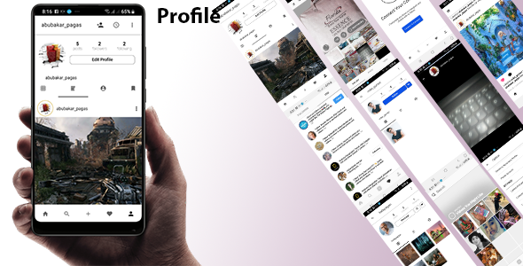
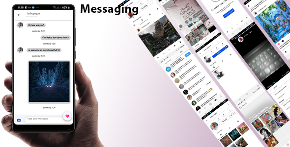
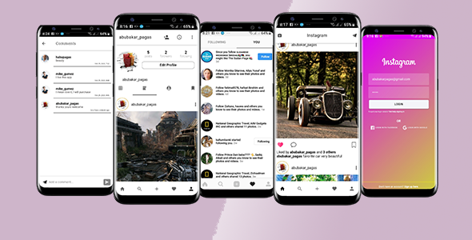

# InstaChat
 
<strong>Overview</strong> 

    

    

        This Application corvers everything that you need in Instagram, written in Ionic 4, 5 and firebase leatest
        version, this is clean code and easy to understand, beautiful, the same functionality of facebook and
        Instagram, this is tested and trusted, you may test by your self,
        firebase leatest version, the app uses SASS, which is known as CSS with power of each component has dedicated
        SASS file for styling make it very beautiful looking UI.
    

    
 

        <!-- for the login user Reviewers1 -->
        
        

            <ul>
                <li>User can login with Email and Password</li>
                <li>When no connection will notify to user.</li>
                <li>Forget Password for user credential.</li>
                <li>User can Register new account.</li>
                <li>User Login with Facebook Account.</li>
                <li>User login with Google Account.</li>
                <li>Email Authentication.</li>
            </ul>
        

    

     

        
    

    

        <ul>
            <li>User can post a Story</li>
            <li>User can post image to Timeline.</li>
            <li>User like and comment on post.</li>
            <li>User can view his comment Notification and Replay, base on what his post in the timeline.</li>
            <li>User Follow and Unfollowing User</li>
            <li>Counting Followers and Following</li>
            <li>User can view his friend infromation</li>
        </ul>
    

    

        
    

    

        <ul>
            <li>User can update his profile</li>
            <li>View your Timeline post.</li>
            <li>Contact syncing.</li>
            <li>Settings appication.</li>
            <li>View Archived</li>
            <li>Searching friend.</li>
        </ul>
    

    

        
    

    

        <ul>
            <li>Messaging one to one chatting</li>
            <li>Send photo message</li>
            <li>Delete Messaging.</li>
            <li>With current time send.</li>
            <li>View user status online and lastseen.</li>
            <li>View user Information</li>
        </ul>
    

    

        
    

    

        <h2>
            <strong>IMPORTANT: </strong>
            Get Started with InstaChat in ionic 4, 5
        </h2>
        

        <ul>
         <li>
             <h3>
                 Download Node js
              </h3>
            </li>
        </ul>
        

            Node.js is an open-source and cross-platform JavaScript runtime environment. It is a popular tool for almost
            any
            kind of project! Download Node js
            <a href="https://nodejs.org/en/download/">https://nodejs.org/en/download/</a>
        

        <ul>
            <li>
                <h3>
                    Installing ionic
                </h3>
            </li>
        </ul>
        

            Ionic apps are created and developed primarily through the Ionic commandline utility. The Ionic CLI is the
            preferred method of installation, as it offers a wide range of dev tools and help options along the way. It
            is
            also the main tool through which to run the app and connect it to other services, such as Ionic Appflow.
            <code style="font-size: medium; color: blue;">
                npm install -g ionic 
            </code>
            Before proceeding, make sure the latest version of Node.js and npm are installed. See
            For more information visit
            <a
                href="https://ionicframework.com/docs/faq/glossary#npm">https://ionicframework.com/docs/faq/glossary#npm</a>
        

        <ul>
            <li>
                <h3>unzip the file.</h3>
            </li>
            <li>
                <h3>open the file , make sure your current folder in your IDE or visual studio code.</h3>
            </li>
            <li>
                <h3>navigate to your terminal</h3>
            </li>
            <li>
                <h3>npm install</h3>
            </li>
            <li>
                <h3>ionic serve </h3>
            </li>
            <li>
                <h3>ionic cordova build android </h3>
            </li>
            <li>
                <h3>ionic cordova build ios</h3>
            </li>
        </ul>
    

